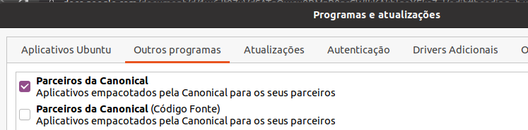
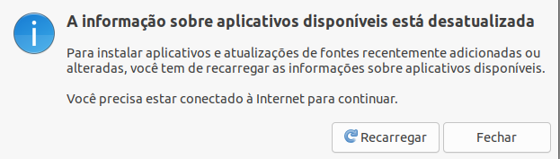

# **ATUALIZAÇÃO DE REPOSITÓRIO**

Habilite os demais repositórios oficiais do ubuntu, use o programa **“Programas e atualizações”**, não habilite repositórios de código fonte, eles irão atrasar a procura por novas atualizações. Ao fazer essas mudanças o programa “Programas e atualizações” irá perguntar se deseja atualizar o repositório, responda “sim”:  

  

e depois:  
  

ou execute no terminal:  
```bash
- sudo apt update -y  
- sudo apt dist-upgrade -y
```

## 
